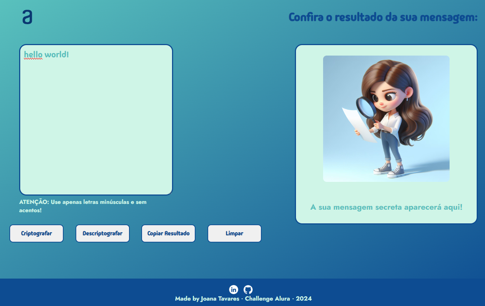

# Desafio Alura - Decodificador de Texto
Projeto desenvolvido usando HTML, JavaScript, CSS, durante o Challenge Decodificador de Texto - Iniciante em Programação T6 da ONE Oracle + Alura 

Escreva mensagens secretas e troque com os amigos!

Deploy: https://joanatav.github.io/challenge-alura-decodificador/

<h2>Preview 👀 </h2>

<h2>⚙️Tecnologias Utilizadas</h2>

